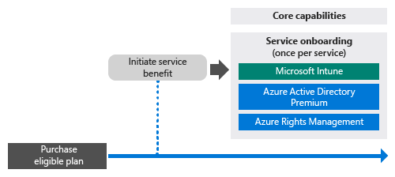
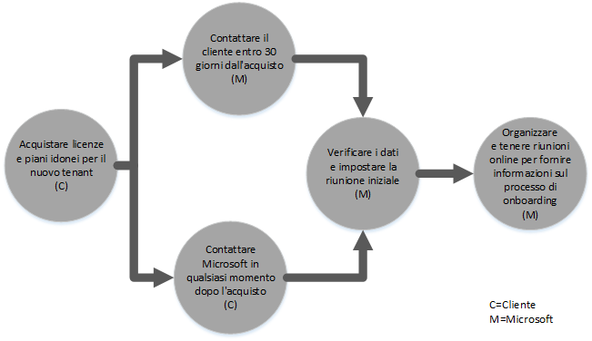
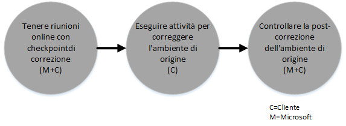
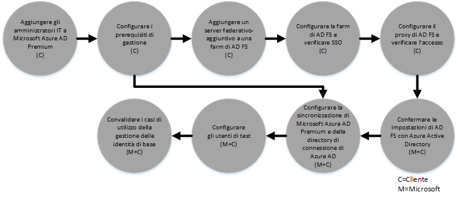

# Processo FastTrack Center Benefit per Azure Active Directory Premium 
Se l'organizzazione è idonea per il vantaggio FastTrack Center per Microsoft Azure AD Premium, è possibile lavorare in remoto con gli specialisti Microsoft per preparare l'ambiente di Microsoft Azure AD Premium. Per verificare l'idoneità dell'organizzazione, vedere [FastTrack Center Benefit per Azure Active Directory Premium](../Topic/FastTrack_Center_Benefit_for_Azure_Active_Directory_Premium.md).

L'articolo fornisce le seguenti informazioni:

-   [Overview of the onboarding process](#overview)

-   [Expectations for your source environment](#expectations_src_environ)

-   [Phases of the onboarding process](#phases_onboarding_process)

-   [Microsoft responsibilities](#microsoft_responsibilities) per ciascuna fase

-   [Your responsibilities](#your_responsibilities) per ciascuna fase

Ecco cosa aspettarsi una volta completato il processo di onboarding:

-   Viene creato il tenant di Microsoft Azure AD Premium.

-   Gli utenti con licenza possono accedere ai servizi di Microsoft Azure AD Premium usando una delle seguenti opzioni di gestione delle identità:

    -   Identità cloud (account univoci di Microsoft Azure AD Premium).

    -   Identità sincronizzate: account di Microsoft Azure AD Premium sincronizzati da Active Directory locale con lo strumento Azure Active Directory Connect (Azure AD Connect) per i clienti con una sola foresta o più foreste Active Directory.

    -   Identità federate --con account di Microsoft Azure AD Premium che sono:

        -   Sincronizzati da Active Directory con lo strumento Microsoft Azure AD Connect per i clienti con una sola configurazione di foresta di Active Directory.

        -   Federati con Active Directory Federation Services (AD FS) 2.0 o versione successiva da Active Directory locale.

## Panoramica del processo di onboarding
Il processo di onboarding presenta due componenti principali:

-   **Funzionalità di base**: attività richieste per la configurazione del tenant e l’integrazione con Azure AD, se necessario. Le funzionalità di base forniscono anche la baseline per l’onboarding di altri servizi Microsoft Online idonei.

-   **Onboarding del servizio**: attività richieste per configurare Microsoft Azure AD Premium in modo autonomo, con la sincronizzazione delle directory Azure AD Connect o AD FS.

Il diagramma seguente illustra la sequenza temporale per l'uso del vantaggio FastTrack Center.

Il processo di base è il seguente:

-   Microsoft tenterà di contattare l'utente entro 30 giorni dalla data di acquisto di un piano idoneo. È anche possibile richiedere assistenza da parte del [FastTrack Center](http://fasttrack.microsoft.com/) se si è pronti per distribuire questi servizi per l'organizzazione. Per richiedere assistenza, accedere al FastTrack Center (http://fasttrack.microsoft.com), passare al dashboard, selezionare il nome della società, fare clic sulla scheda relativa alle offerte e scegliere il pulsante per richiedere assistenza per il servizio idoneo. Una volta contattato il supporto tecnico di onboarding, verrà impostata la pianificazione di riunioni online.

-   Il team di Microsoft offrirà supporto per le funzionalità di base e durante il primo onboarding di ciascun servizio idoneo.

Tutto il supporto tecnico di onboarding verrà fornito in remoto dal personale Microsoft dedicato:

-   Microsoft fornirà assistenza in remoto per varie attività di onboarding utilizzando una combinazione di strumenti, documentazione e istruzioni. Per consentire a Microsoft di eseguire determinate attività di configurazione al posto dell'utente, scegliere di fornire accesso e autorizzazioni appropriati a Microsoft per completare tali attività.

-   Il supporto tecnico di onboarding viene fornito dal FastTrack Center ed è disponibile durante il regolare orario lavorativo in base all'area geografica.

-   Il supporto tecnico di onboarding è disponibile in cinese tradizionale, inglese, francese, tedesco, italiano, giapponese, portoghese (Brasile) o spagnolo.

-   Il team di Microsoft può lavorare direttamente con l'utente oppure con il rappresentante.

## Previsioni per l'ambiente di origine
Se Microsoft Active Directory locale è già presente nell'ambiente di origine, è possibile integrarlo con Microsoft Azure AD Premium per usare le funzionalità complete di gestione delle identità da una sola console. Il vantaggio FastTrack Center supporta l'utente durante l'integrazione di Microsoft Azure AD Premium con l'implementazione locale esistente.  Se è necessario l'integrazione, l'ambiente di origine deve essere a un livello minimo per tale applicazione.

Nella tabella seguente vengono illustrate le previsioni nell'ambiente di origine esistente per l’onboarding.

|Attività|Previsione per l’ambiente di origine|
|------------|----------------------------------------|
|Funzionalità di base|Foreste di Active Directory con il livello di foresta funzionale impostato su Windows Server 2008 o versione successiva, con la seguente configurazione di foresta:  -   Foresta di Active Directory singola -   Foreste di Active Directory multiple **Note:** Per tutte le configurazioni con più foreste, la distribuzione di AD FS esula dall'ambito del vantaggio FastTrack Center.|
|Onboarding del servizio  -   Microsoft Azure AD Premium|Active Directory e l'ambiente locali sono stati preparati per Azure AD Premium, che include la correzione dei problemi identificati che impediscono l'integrazione con le funzionalità di Azure AD e Azure AD Premium.|

## Fasi del processo di onboarding
L'onboarding di Microsoft Azure AD Premium ha cinque fasi principali, come mostrato nella figura seguente:

-   Avvia

-   Valuta

-   Correggi

-   Attiva

-   Chiudi

Per attività dettagliate relative a ciascuna fase, vedere le sezioni [Microsoft responsibilities](#microsoft_responsibilities) e [Your responsibilities](#your_responsibilities).

### Fase di avvio
Dopo aver acquistato il numero appropriato di licenze, attenersi alle istruzioni nel messaggio di conferma dell'acquisto per associare le licenze al tenant esistente o a un tenant nuovo. Microsoft verificherà l'idoneità al vantaggio FastTrack Center. Microsoft tenterà di contattare l'utente entro 30 giorni dalla data di acquisto di un piano idoneo. È anche possibile richiedere assistenza da parte del [FastTrack Center](http://fasttrack.microsoft.com/) se si è pronti per distribuire questi servizi per l'organizzazione. Per richiedere assistenza, accedere al FastTrack Center (http://fasttrack.microsoft.com), passare al dashboard, selezionare il nome della società, fare clic sulla scheda relativa alle offerte e scegliere il pulsante per richiedere assistenza per il servizio idoneo. Una volta contattato il supporto tecnico di onboarding, verrà impostata la pianificazione di riunioni online.

Durante questa fase, verrà discusso il processo di onboarding, verranno verificati i dati e verrà impostata la riunione iniziale.

### Fase di valutazione
Una volta avviato il processo di onboarding, Microsoft assisterà l'utente nel valutare l'ambiente di origine e i requisiti. Verranno eseguiti strumenti per valutare l’ambiente e Microsoft guiderà l'utente nella valutazione di Active Directory locale, browser Internet, sistemi operativi dei dispositivi client, DNS, rete, infrastruttura e sistema di identità, in caso fossero necessarie modifiche per l'onboarding. In base all'impostazione corrente verrà suggerito un piano di correzione che fornirà all'ambiente di origine i requisiti minimi per l'onboarding di Microsoft Azure AD Premium. Verranno inoltre stabilite delle chiamate di controllo appropriate per la fase di correzione.

### Fase di correzione
Se necessario, l'utente eseguirà le attività del piano di correzione nell'ambiente di origine, per soddisfare i requisiti per l’onboarding di ciascun servizio.

Prima di iniziare la fase di attivazione, verranno verificati i risultati delle attività di correzione per essere certi che l'utente sia pronto a procedere.

### Fase di attivazione
Una volta completate tutte le attività di correzione, il progetto passa alla configurazione dell'infrastruttura di base per l'utilizzo del servizio e per il provisioning di Microsoft Azure AD Premium.

**Fase di attivazione - Funzionalità di base**

L'attivazione delle funzionalità di base prevede il provisioning di servizi e l'integrazione di identità e tenant. Include anche la procedura per fornire una base l'onboarding di Microsoft Azure AD Premium.

L'onboarding per Microsoft Azure AD Premium può iniziare al termine dell'onboarding di base.

**Fase di abilitazione - Microsoft Azure AD Premium**

L'ambiente di Microsoft Azure AD Premium può essere configurato con la sincronizzazione delle directory Azure AD Connect e Active Directory Federation Services (AD FS), se necessario.

Per gli scenari di Microsoft Azure AD Premium che includono la sincronizzazione delle identità locali nel cloud, Microsoft supporterà l'utente aggiungendo amministratori IT e utenti alla sottoscrizione, configurando i prerequisiti di gestione, configurando Microsoft Azure AD Premium, impostando la sincronizzazione delle directory e di Active Directory Federation Services con Azure AD Connect, configurando gli utenti di test e convalidando i casi di utilizzo di base per il servizio.

L'installazione di Microsoft Azure AD Premium include l'abilitazione delle seguenti funzionalità:

-   Reimpostazione password self-service (SSPR)

-   Azure Multi-factor Authentication (MFA)

-   Applicazione Software as a Service (SaaS): configurare un'applicazione SaaS

-   Gestione di gruppi self-service (SSGM)

-   Report amministrativi

## Responsabilità di Microsoft

### Generale

-   Fornire all'utente assistenza remota per le necessarie attività di configurazione, come descritto in dettaglio nella fase.

-   All'utente vengono forniti documentazione disponibile, strumenti software, console di amministrazione e script per ridurre o eliminare le attività di configurazione.

Per usare il vantaggio FastTrack Center non è necessario fornire l'accesso e le autorizzazioni a Microsoft. In alcuni casi, è possibile scegliere di fornire a Microsoft l'accesso e le autorizzazioni appropriati per eseguire specifiche attività per conto dell'utente.

### Fase di avvio

-   Contattare l'utente entro 30 giorni dall’acquisto di licenze idonee per un nuovo tenant.

-   Collaborare con l'utente nell'avvio del processo di onboarding entro 90 giorni dall'acquisto di licenze idonee.

-   Definire i servizi idonei da caricare.

### Fase di valutazione

-   Fornire una panoramica sull’amministrazione.

-   Fornire indicazioni su:

    -   Esigenze di DNS, rete e infrastruttura.

    -   Esigenze del client (esigenze di browser Internet, sistema operativo del client e servizi).

    -   Identità dell'utente e provisioning.

    -   Identificazione dei requisiti di sincronizzazione delle directory.

    -   Valutazione della sincronizzazione hash delle password per stabilire se soddisfa gli obiettivi del cliente o se è necessario AD FS.

    -   Abilitazione dei servizi che sono stati acquistati e definiti come parte dell'onboarding.

    -   Identificazione dei requisiti obbligatori per l'ambiente pilota e di test, ad esempio account di test e istanze di test delle applicazioni SaaS (ad esempio, SalesForce).

-   Stabilire la sequenza temporale per le attività di correzione.

-   Fornire un elenco di controllo della correzione.

### Fase di correzione

-   Effettuare conferenze telefoniche con l'utente in base a una pianificazione concordata per esaminare l'avanzamento delle attività di correzione.

-   Assistere all'esecuzione di strumenti per identificare e risolvere problemi e all’interpretazione dei risultati.

### Fase di attivazione
Fornire indicazioni su:

-   Attivazione del tenant di Microsoft Azure AD Premium.

-   Configurazione delle porte del firewall.

-   Configurazione del DNS per servizi idonei.

-   Convalida della connettività nei servizi di Microsoft Azure AD Premium.

-   Per un ambiente a foresta singola:

    -   Installazione di una sincronizzazione delle directory tra Active Directory Domain Services (AD DS) e Azure AD Connect, se richiesto.

    -   Configurazione della sincronizzazione delle password con lo strumento Azure AD Connect.

-   Per un ambiente a più foreste:

    -   Installare la sincronizzazione Azure AD Connect e impostarla per scenari a più foreste. La sincronizzazione hash e il writeback delle password supportano più foreste.  Tuttavia, gli altri scenari di writeback non sono supportati.

    -   Configurare la sincronizzazione tra foreste di Active Directory locale e la directory di Microsoft Azure AD Premium (Azure Active Directory).

        > [!NOTE]
        > Sviluppo e implementazione per estensioni di regole personalizzate non rientrano nell'ambito.

-   Per una singola foresta se la destinazione sono le identità federate: installazione e configurazione di Active Directory Federation Services (AD FS) per l'autenticazione di domini locali con Microsoft Azure AD Premium in una configurazione con un solo sito a tolleranza di errore, se necessario.

    > [!NOTE]
    > Per tutte le configurazioni di più foreste, le distribuzioni di AD FS non rientrano nell'ambito.

-   Test della funzionalità SSO (Single Sign-On), se distribuita.

#### Fase di abilitazione - Azure AD Premium -- con Azure AD Connect e AD FS
Fornire indicazioni sulla configurazione di:

-   Provisioning utenti, incluse le licenze.

-   Sincronizzazione delle directory Azure AD Connect (con sincronizzazione hash e il writeback delle password ).

-   Active Directory Federation Services (AD FS).

-   Reimpostazione password self-service (SSPR).

-   Azure Multi-Factor Authentication (MFA).

-   Un'applicazione integrata che può includere le applicazioni SSO (Single Sign-On) per SaaS.

-   Report sull'utilizzo e sulla sicurezza per gli amministratori.

-   Gestione di gruppi self-service (SSGM).

-   Proxy di applicazione.

-   Notifiche di amministratore.

-   Schermata di accesso personalizzata, con logo, testo e immagini.

## Responsabilità dell’utente
In questa sezione vengono descritte alcune delle responsabilità dell’utente durante il processo di onboarding.

### Generale

-   Eventuali miglioramenti e integrazioni al tenant di Microsoft Azure AD Premium oltre le opzioni configurabili elencate nel presente articolo.

-   Programma generale e gestione dei progetti delle risorse.

-   Comunicazioni degli utenti finali, documentazione, formazione e gestione delle modifiche.

-   Documentazione di supporto tecnico e formazione.

-   Produzione di report, presentazioni o verbali di riunioni specifiche per l'organizzazione.

-   Creazione di documentazione tecnica e architetturale specifica dell'organizzazione.

-   Progettazione, conseguimento, installazione e configurazione di hardware e rete.

-   Conseguimento, installazione e configurazione di software.

-   Gestione, configurazione e applicazione dei criteri di sicurezza, oltre a quelli creati per il test delle funzionalità e della configurazione di base dei servizi Microsoft Azure AD Premium.

-   Registrazione degli account utente, oltre a quelli usati per testare le funzionalità e la configurazione di base dei servizi Microsoft Azure AD Premium.

-   Configurazione di rete, analisi, convalida della larghezza di banda, verifica e monitoraggio.

-   Gestione del processo di approvazione della gestione di una modifica tecnica e creazione della documentazione di supporto.

-   Modifica delle guide operative e dei modelli operativi.

-   Impostazione dell’autenticazione a più fattori locale.

-   Rimozione delle autorizzazioni e degli ambienti di origine e dei servizi usati precedentemente dal cliente.

-   Creazione e mantenimento dell'ambiente di test.

-   Installazione di Service Pack e altri aggiornamenti necessari su server dell'infrastruttura.

-   Fornitura e configurazione di tutti i certificati SSL pubblici.

-   Scrittura dell'istruzione delle Condizioni per l'utilizzo da configurare e visualizzare nei dispositivi di proprietà degli utenti finali.

### Fase di avvio

-   Collaborare con il team di Microsoft per iniziare l'onboarding dei servizi idonei.

-   Partecipare alla riunione di inizio della collaborazione, gestire e guidare i partecipanti dell'organizzazione e confermare i tempi di correzione.

### Fase di valutazione

-   Identificare le parti interessate, tra cui un project manager, per completare le attività di valutazione necessarie.

-   Se si desidera, condividere lo schermo con Microsoft se sono necessarie informazioni aggiuntive durante l'esecuzione di strumenti di valutazione per l'ambiente o la sottoscrizione di Microsoft Azure AD Premium.

-   Partecipare alle riunioni per creare l'elenco di controllo delle correzioni e contribuire al piano generale, che include argomenti quali: infrastruttura, rete, amministrazione, preparazione alla sincronizzazione delle directory, protezione della rete e identità federata.

-   Partecipare alle riunioni per delineare l'approccio di provisioning utente.

-   Partecipare alle riunioni per pianificare la configurazione del servizio online.

-   Creare un piano di supporto per la preparazione della migrazione.

### Fase di correzione

-   Eseguire i passaggi necessari per completare le attività di correzione identificate nella fase di valutazione.

-   Partecipare alle riunioni di checkpoint.

### Fase di attivazione

-   Se si desidera, condividere la schermata con Microsoft se sono necessarie informazioni quando si apportano modifiche all'ambiente o alla sottoscrizione di Microsoft Azure AD Premium.

-   Gestire le risorse in modo appropriato.

-   Configurare gli elementi relativi alla rete in base alle linee guida Microsoft.

-   Eseguire la preparazione della directory e configurarne la sincronizzazione in base alle linee guida di Microsoft.

-   Configurare l'infrastruttura correlata alla protezione (ad esempio le porte del firewall) in base alle linee guida Microsoft.

-   Implementare l'infrastruttura client in modo appropriato.

-   Implementare l’approccio di provisioning utente in base alle linee guida Microsoft.

-   Abilitare i vari servizi in base alle linee guida di Microsoft.

## Ulteriori informazioni
Vedere [Microsoft Azure Active Directory](http://azure.microsoft.com/en-us/documentation/services/active-directory/) ed [Enterprise Mobility Suite](http://www.microsoft.com/en-us/server-cloud/products/enterprise-mobility-suite/default.aspx).

