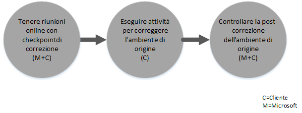

# Processo FastTrack Center Benefit per Intune
Se l'organizzazione ha diritto al service benefit di Microsoft Intune, è possibile lavorare in remoto con gli specialisti Microsoft per preparare l'ambiente di Microsoft Intune.

Microsoft Intune fa parte di Microsoft Enterprise Mobility Suite (EMS), che fornisce le funzionalità Enterprise Mobility Management (EMM), incluse Gestione di dispositivi mobili (MDM) e Gestione di applicazioni mobili (MAM).  È possibile usare Microsoft Intune per consentire la produttività dei dipendenti nei dispositivi mobili grazie al provisioning e alla configurazione dei dispositivi e alla distribuzione di app per dispositivi mobili.  Microsoft Intune può essere usato anche per proteggere i dati aziendali mediante il monitoraggio della conformità dei dispositivi, la protezione dei dati e delle applicazioni mobili e l'integrazione con Azure AD per controllare l'accesso ai servizi aziendali.

Per verificare l'idoneità dell'organizzazione, vedere [FastTrack Center Benefit per Intune](../Topic/FastTrack_Center_Benefit_for_Intune.md). Per informazioni su come preparare l'ambiente per altri servizi Enterprise Mobility Suite, vedere [FastTrack Center Benefit per Enterprise Mobility Suite](../Topic/FastTrack_Center_Benefit_for_Enterprise_Mobility_Suite.md).

**Per informazioni su Microsoft FastTrack per Office 365, Vedere** [FastTrack Center Benefit per Office 365](https://technet.microsoft.com/library/office-365-onboarding-benefit.aspx).

Questo articolo fornisce le informazioni seguenti sul service benefit per Microsoft Intune:

-   [Overview of the onboarding process](#overview_onboarding_process)

-   [Expectations for your source environment](#expectations_src_environ)

-   [Phases of the onboarding process](#phases_onboarding_process)

-   [Microsoft responsibilities](#microsoft_responsibilities) per ciascuna fase

-   [Your responsibilities](#your_responsibilities) per ciascuna fase

Ecco cosa aspettarsi una volta completato il processo di onboarding:

-   Viene creato il tenant di Microsoft Online Service.

-   Gli utenti con licenza possono accedere al servizio Microsoft Intune utilizzando una delle seguenti opzioni di gestione delle identità:

    -   Identità cloud (account dei servizi online di Microsoft univoci).

    -   Identità sincronizzate: account di Microsoft Intune sincronizzati da Active Directory locale con Azure Active Directory Connect (servizi di sincronizzazione):

        -   Per i clienti con un unico ambiente di foresta Active Directory.

        -   Per i clienti con una topologia supportata a più foreste Active Directory.

-   Identità federate -- Account di Microsoft Intune:

    -   Sincronizzati da Active Directory con lo strumento Microsoft Azure Active Directory Connect per i clienti con una sola configurazione della foresta Active Directory oppure per i clienti con una sola foresta di account Active Directory (anche nota come "foresta di accesso") e una sola configurazione della foresta di risorse Active Directory.

    -   Federati con il ruolo Windows Server 2012 R2 Active Directory Federation Services da Active Directory locale oppure federate con Active Directory Federation Services (AD FS) 2.0 o versione successiva da Active Directory locale.

## Panoramica del processo di onboarding
Il processo di onboarding presenta due componenti principali:

-   **Funzionalità di base**: attività richieste per la configurazione del tenant e l’integrazione con Azure AD, se necessario. Il componente di funzionalità di base fornisce inoltre la baseline per l'onboarding di altri servizi idonei.

-   **Onboarding dei servizi**: attività necessarie per configurare Microsoft Intune.

Il diagramma seguente illustra la sequenza di eventi per l'uso del vantaggio FastTrack Center.

Il processo di base è il seguente:

-   FastTrack Center tenterà di contattare l'utente entro 30 giorni dalla data di acquisto di un piano idoneo. È anche possibile richiedere assistenza da parte del [FastTrack Center](http://fasttrack.microsoft.com/) se si è pronti per distribuire questi servizi per l'organizzazione. Per richiedere assistenza, accedere a [FastTrack Center](http://fasttrack.microsoft.com/), andare nel dashboard, selezionare il nome dell'azienda, fare clic sulla scheda Offerte, quindi scegliere il pulsante per richiedere assistenza per Microsoft Intune, Azure Active Directory Premium o Azure Rights Management Premium.

-   FastTrack Center offrirà supporto per le funzionalità di base e nel primo onboarding di ciascun servizio idoneo.

Tutto il supporto tecnico di onboarding verrà fornito in remoto dal personale Microsoft dedicato:

-   Microsoft fornirà assistenza in remoto per varie attività di onboarding utilizzando una combinazione di strumenti, documentazione e istruzioni.

-   Il supporto tecnico di onboarding viene fornito dal FastTrack Center ed è disponibile durante il regolare orario lavorativo in base all'area geografica.

-   Il supporto tecnico di onboarding è disponibile in cinese tradizionale, inglese, francese, tedesco, italiano, giapponese, portoghese (Brasile) o spagnolo.

-   Il team di Microsoft può lavorare direttamente con l'utente oppure con il rappresentante.

## Previsioni per l'ambiente di origine
È possibile che l’utente disponga già di servizi nell’ambiente di origine che desidera spostare o integrare con il servizio Microsoft Intune. Per alcuni servizi, il vantaggio FastTrack Center per Intune include il supporto per la configurazione di alcuni livelli di integrazione con l'ambiente di origine. Se l’integrazione è necessaria, l'ambiente di origine deve essere a un livello minimo per tale applicazione.

Nella tabella seguente vengono illustrate le previsioni nell'ambiente di origine esistente per l’onboarding.

|Attività|Previsione per l’ambiente di origine|
|------------|----------------------------------------|
|Funzionalità di base|Foreste di Active Directory con il livello di foresta funzionale impostato su Windows Server 2008 o versione successiva, con la seguente configurazione di foresta:  -   Foresta di Active Directory singola -   Foreste di Active Directory multiple **Note:** Per tutte le configurazioni con più foreste, la distribuzione di AD FS esula dall'ambito del vantaggio FastTrack Center.|
|Onboarding del servizio  -   Microsoft Intune -   Microsoft Intune integrato con System Center Configuration Manager|Per la gestione di dispositivi con System Center Configuration Manager 2012 R2 o versione successiva connessi a Microsoft Intune, gli amministratori IT dovranno seguire l'[Elenco di controllo amministratore: Configurazione di Configuration Manager per la gestione di dispositivi mobili mediante Microsoft Intune](https://technet.microsoft.com/library/jj943763.aspx). **Note:** Il service benefit non include il supporto per la configurazione o l'aggiornamento di System Center Configuration Manager ai requisiti minimi necessari per Microsoft Intune integrato con System Center Configuration Manager.|

## Fasi del processo di onboarding
Il processo di onboarding presenta quattro fasi principali:

-   Avvia

-   Valuta

-   Correggi

-   Attiva

Per attività dettagliate relative a ciascuna fase, vedere le sezioni [Microsoft responsibilities](#microsoft_responsibilities) e [Your responsibilities](#your_responsibilities).

### Fase di avvio
Dopo aver acquistato i tipi e il numero appropriato di licenze, attenersi alle istruzioni nell'e-mail di conferma dell'acquisto per associare le licenze al tenant esistente o a un tenant nuovo. FastTrack Center verificherà l'idoneità al service benefit. Microsoft tenterà di contattare l'utente entro 30 giorni dalla data di acquisto di un piano idoneo. È anche possibile richiedere assistenza da parte del [FastTrack Center](http://fasttrack.microsoft.com/) se si è pronti per distribuire questi servizi per l'organizzazione. Per richiedere assistenza, accedere a [FastTrack Center](http://fasttrack.microsoft.com/), andare nel dashboard, selezionare il nome dell'azienda, fare clic sulla scheda Offerte, quindi scegliere il pulsante per richiedere assistenza per Microsoft Intune, Azure Active Directory Premium o Azure Rights Management Premium.

Durante questa fase, verrà discusso il processo di onboarding, verranno verificati i dati e verrà impostata la riunione iniziale.

### Fase di valutazione
Una volta avviato il processo di onboarding, Microsoft assisterà l'utente nel valutare l'ambiente di origine e i requisiti. Verranno eseguiti strumenti per valutare l’ambiente e Microsoft guiderà l'utente nella valutazione di browser Internet, sistemi operativi di client, DNS, rete, infrastruttura e sistema di identità, in caso fossero necessarie modifiche per l'onboarding. In base all'impostazione corrente, verrà suggerito un piano di correzione che fornirà all'ambiente di origine i requisiti minimi per l'onboarding a Microsoft Intune. Verranno inoltre stabilite delle chiamate di controllo appropriate per la fase di correzione.

### Fase di correzione
Se necessario, l'utente eseguirà le attività del piano di correzione nell'ambiente di origine, per soddisfare i requisiti per l’onboarding di ciascun servizio.

Prima di iniziare la fase di attivazione, verranno verificati i risultati delle attività di correzione per essere certi che l'utente sia pronto a procedere.

### Fase di attivazione
Una volta completate tutte le attività di correzione, il progetto passa alla configurazione dell'infrastruttura di base per l'utilizzo del servizio e per il provisioning di Microsoft Intune.

**Fase di attivazione - Funzionalità di base**

L'attivazione delle funzionalità di base prevede il provisioning di servizi e l'integrazione di identità e tenant. Include inoltre la procedura per fornire una base per i servizi di onboarding Microsoft Intune.

L'onboarding per Microsoft Intune può iniziare al termine dell'attivazione delle funzionalità di base.

**Fare di attivazione – Microsoft Intune**

In base alle esigenze di gestione dei dispositivi mobili e delle applicazioni mobili, verranno fornite informazioni su come usare Microsoft Intune per gestire i dispositivi. La procedura esatta dipende dall'ambiente di origine e può includere:

-   Concessione di licenze agli utenti finali. Se necessario, verrà fornita anche assistenza su come attivare i contratti multilicenza per il tenant del servizio cloud Microsoft.

-   Configurazione delle identità da usare con Microsoft Intune, tramite Active Directory locale o le identità cloud.

-   Aggiunta di utenti alla sottoscrizione di Microsoft Intune, definizione dei ruoli di amministratore IT e creazione di gruppi di utenti e di dispositivi.

-   Configurazione dell'autorità di gestione dei dispositivi mobili in base alle specifiche esigenze di gestione:

    -   Impostare Microsoft Intune come autorità MDM quando è l'unica soluzione MDM o è in combinazione con Gestione di dispositivi mobili per Office 365.

    -   Se è presente un'implementazione esistente di System Center Configuration Manager e si vogliono espandere le funzionalità di gestione con Microsoft Intune, impostare Configuration Manager come autorità MDM.

        > [!NOTE]
        > Per usare Gestione di applicazioni mobili solo nei dispositivi di proprietà degli utenti finali, nei dispositivi condivisi o nei dispositivi con modalità tutto schermo, la configurazione di un'autorità MDM non è necessaria.

-   Se Gestione di dispositivi mobili rientra nel proprio ambito, verranno fornite istruzioni su:

    -   Configurazione dei gruppi di test da usare per la convalida dei criteri di gestione MDM.

    -   Configurazione dei servizi e dei criteri di gestione MDM quali:

        -   Distribuzione dell'applicazione per ogni piattaforma supportata tramite collegamenti Web o collegamenti diretti.

        -   Criteri di accesso condizionale.

        -   Distribuzione dei profili di posta elettronica.

        -   Configurazione di Microsoft Intune Exchange Connector, quando applicabile.

    -   Registrazione di un massimo di due dispositivi di test per ogni [piattaforma supportata](https://technet.microsoft.com/library/dn600287.aspx) in Microsoft Intune o in Configuration Manager con il servizio Microsoft Intune.

    -   Uso dei report dell’inventario software e hardware.

-   Se Gestione di applicazioni mobili (MAM) rientra nel proprio ambito o se si cerca di integrare la soluzione MDM Microsoft o di terze parti esistente con i criteri MAM, verranno fornite istruzioni su:

    -   Configurazione dei criteri MAM per ogni piattaforma supportata.

    -   Configurazione dei criteri di accesso condizionale per le app gestite.

    -   Indirizzamento ai gruppi di utenti appropriati con i criteri MAM descritti in precedenza.

    -   Uso dei report sull'utilizzo delle applicazioni gestite.

-   Se la gestione del PC rientra nel proprio ambito, verranno fornite istruzioni su:

    -   Installazione del software client di Intune, se necessario.

    -   Uso dei report software e hardware disponibili in Intune.

## Responsabilità di Microsoft
In questa sezione vengono descritte alcune delle responsabilità di Microsoft durante il processo di onboarding.

### Generale

-   Viene fornita assistenza remota per le attività di configurazione necessarie, come descritto in dettaglio nelle fasi riportate.

-   All'utente vengono forniti documentazione disponibile, strumenti software, console di amministrazione e script per ridurre o eliminare le attività di configurazione.

### Fase di avvio

-   Contattare l'utente entro 30 giorni dall’acquisto di licenze idonee per un nuovo tenant.

-   Collaborare con l'utente per avviare l'onboarding.

-   Definire i servizi idonei da caricare.

### Fase di valutazione

-   Fornire una panoramica sull’amministrazione.

-   Fornire indicazioni su:

    -   Esigenze di DNS, rete e infrastruttura.

    -   Esigenze del client (esigenze di browser Internet, sistema operativo del client e servizi).

    -   Identità dell'utente e provisioning.

    -   Abilitazione dei servizi che sono stati acquistati e definiti come parte dell'onboarding.

-   Stabilire la sequenza temporale per le attività di correzione.

-   Fornire un elenco di controllo della correzione.

### Fase di correzione

-   Effettuare conferenze telefoniche con l'utente in base a una pianificazione concordata per esaminare l'avanzamento delle attività di correzione.

-   Assistere all'esecuzione di strumenti per identificare e risolvere problemi e all’interpretazione dei risultati.

### Fase di attivazione
Fornire indicazioni su:

-   Attivazione del tenant dei servizi online di Microsoft.

-   Configurazione di protocolli TCP/IP e porte del firewall.

-   Configurazione del DNS per servizi idonei.

-   Convalida di connettività ai servizi online di Microsoft.

-   Per un ambiente a foresta singola:

    -   Installazione di un server di sincronizzazione delle directory tra i Servizi di dominio Active Directory (AD DS) e i servizi online Microsoft idonei, se necessario.

    -   Configurazione della sincronizzazione delle password (hash della password) in Microsoft Intune (Azure Active Directory) con lo strumento di Azure Active Directory Connect.

        > [!NOTE]
        > Sviluppo e implementazione per estensioni di regole personalizzate non rientrano nell'ambito.

-   Per una singola foresta se la destinazione sono le identità federate: Installazione e configurazione di Active Directory Federation Services (ADFS) per l'autenticazione di domini locali con Microsoft Intune in un solo sito e configurazione a tolleranza di errore, se necessario.

    > [!NOTE]
    > Per tutte le configurazioni di più foreste, le distribuzioni di AD FS non rientrano nell'ambito.

-   Test sulla funzionalità SSO (Single Sign-On) se distribuita.

#### Fare di attivazione – Microsoft Intune
Fornire indicazioni su:

-   Concessione di licenze agli utenti finali. Se necessario, verrà fornita anche assistenza su come attivare i contratti multilicenza per il tenant del servizio cloud Microsoft.

-   Configurazione delle identità da usare con Microsoft Intune, tramite Active Directory locale o le identità cloud.

-   Aggiunta di utenti alla sottoscrizione di Microsoft Intune, definizione dei ruoli di amministratore IT e creazione di gruppi di utenti e di dispositivi.

-   Configurazione dell'autorità di gestione dei dispositivi mobili in base alle specifiche esigenze di gestione:

    -   Impostare Microsoft Intune come autorità MDM quando è l'unica soluzione MDM o è in combinazione con Gestione di dispositivi mobili per Office 365.

    -   Se è presente un'implementazione esistente di System Center Configuration Manager e si vogliono espandere le funzionalità di gestione con Microsoft Intune, impostare Configuration Manager come autorità MDM.

        > [!NOTE]
        > Per usare Gestione di applicazioni mobili solo nei dispositivi di proprietà degli utenti finali, nei dispositivi condivisi o nei dispositivi con modalità tutto schermo, la configurazione di un'autorità MDM non è necessaria.

-   Se Gestione di dispositivi mobili rientra nel proprio ambito, verranno fornite istruzioni su:

    -   Configurazione dei gruppi di test da usare per la convalida dei criteri di gestione MDM.

    -   Configurazione dei servizi e dei criteri di gestione MDM quali:

        -   Distribuzione dell'applicazione per ogni piattaforma supportata tramite collegamenti Web o collegamenti diretti.

        -   Criteri di accesso condizionale.

        -   Distribuzione dei profili di posta elettronica.

        -   Configurazione di Microsoft Intune Exchange Connector, quando applicabile.

    -   Registrazione di un massimo di due dispositivi di test per ogni piattaforma supportata in Microsoft Intune o in Configuration Manager con il servizio Microsoft Intune.

    -   Uso dei report di inventario hardware/software.

-   Se Gestione di applicazioni mobili (MAM) rientra nel proprio ambito o se si cerca di integrare la soluzione MDM di terze parti esistente con i criteri MAM, verranno fornite istruzioni su:

    -   Configurazione dei criteri MAM per ogni piattaforma supportata.

    -   Configurazione dei criteri di accesso condizionale per le app gestite.

    -   Indirizzamento ai gruppi di utenti appropriati con i criteri MAM descritti in precedenza.

    -   Uso dei report sull'utilizzo delle applicazioni gestite.

-   Se la gestione del PC rientra nel proprio ambito, verranno fornite istruzioni su:

    -   Installazione del software client di Intune, se necessario.

    -   Uso dei report software e hardware disponibili in Intune.

## Responsabilità dell’utente
In questa sezione vengono descritte alcune delle responsabilità dell’utente durante il processo di onboarding.

### Generale

-   Eventuali miglioramenti e integrazioni al tenant del servizio Microsoft Online oltre le opzioni configurabili elencate nel presente articolo.

-   Programma generale e gestione dei progetti delle risorse.

-   Comunicazioni degli utenti finali, documentazione, formazione e gestione delle modifiche.

-   Documentazione di supporto tecnico e formazione.

-   Produzione di report, presentazioni o verbali di riunioni specifiche per l'organizzazione.

-   Creazione di documentazione tecnica e architetturale specifica dell'organizzazione.

-   Progettazione, conseguimento, installazione e configurazione di hardware e rete.

-   Conseguimento, installazione e configurazione di software.

-   Configurazione, preparazione e distribuzione di software client necessari per Microsoft Intune.

-   Attivazione di dispositivi mobili

-   Configurazione di rete, analisi, convalida della larghezza di banda, verifica e monitoraggio.

-   Gestione del processo di approvazione della gestione di una modifica tecnica e creazione della documentazione di supporto.

-   Specificazione e definizione dei criteri di gruppo per la gestione di utenti, workstation e server.

-   Modifica delle guide operative e dei modelli operativi.

-   Impostazione dell’autenticazione a più fattori.

-   Disattivazione e rimozione di ambienti di origine (come altre soluzioni di gestione di PC o dispositivi).

-   Creazione e mantenimento dell'ambiente di test.

-   Installazione di Service Pack e altri aggiornamenti necessari su server dell'infrastruttura.

-   Fornitura e configurazione di tutti i certificati SSL pubblici.

-   Scrittura dell'istruzione per le Condizioni per l'utilizzo da configurare e visualizzare nei portali di Microsoft Intune accessibili agli utenti finali.

### Fase di avvio

-   Collaborare con il team di Microsoft per iniziare l'onboarding dei servizi idonei.

-   Partecipare alla riunione di inizio della collaborazione, gestire e guidare i partecipanti dell'organizzazione e confermare i tempi di correzione.

### Fase di valutazione

-   Identificare le parti interessate, tra cui un project manager, per completare le attività di valutazione necessarie.

-   Se si desidera, condividere lo schermo con Microsoft se sono necessarie informazioni aggiuntive durante l'esecuzione di strumenti di valutazione per l'ambiente o la sottoscrizione di Microsoft Intune.

-   Partecipare alle riunioni per creare l'elenco di controllo delle correzioni e contribuire al piano generale, che include argomenti quali: infrastruttura, rete, amministrazione, preparazione alla sincronizzazione delle directory, protezione della rete e identità federata.

-   Partecipare alle riunioni per delineare l'approccio di provisioning utente.

-   Partecipare alle riunioni per pianificare la configurazione del servizio online.

-   Creare un piano di supporto per la preparazione della migrazione.

### Fase di correzione

-   Eseguire i passaggi necessari per completare le attività di correzione identificate nella fase di valutazione.

-   Partecipare alle riunioni di checkpoint.

### Fase di attivazione

-   Se si desidera, condividere lo schermo con Microsoft se sono necessarie informazioni aggiuntive durante l'esecuzione di modifiche per l'ambiente o la sottoscrizione del servizio online Microsoft.

-   Gestire le risorse in modo appropriato.

-   Configurare gli elementi relativi alla rete in base alle linee guida Microsoft.

-   Eseguire la preparazione della directory e configurarne la sincronizzazione in base alle linee guida di Microsoft.

-   Configurare l'infrastruttura correlata alla protezione (ad esempio le porte del firewall) in base alle linee guida Microsoft.

-   Implementare l'infrastruttura client in modo appropriato.

-   Implementare l’approccio di provisioning utente in base alle linee guida Microsoft.

-   Abilitare i vari servizi in base alle linee guida di Microsoft.

-   Collaborare con Microsoft per completare l'onboarding di tutti i servizi entro 12 mesi dall'avvio dell'onboarding.

-   Quando si abilita la gestione di PC o dispositivi mobili con Microsoft Intune, utilizzare dispositivi di test durante l'abilitazione di criteri di gestione tramite Microsoft Intune. Se non sono disponibili dispositivi di test, i clienti sono responsabili del backup e, se necessario, del ripristino di tutto il contenuto dei dispositivi utilizzati durante la fase di attivazione di Microsoft Intune.

-   Selezione di un massimo di due applicazioni per ogni piattaforma Microsoft Intune supportata che può essere distribuita attraverso collegamenti web o completi.

-   Gestione, configurazione e applicazione dei criteri di protezione oltre quelli utilizzati per verificare la funzionalità e la configurazione di base dei servizi di Microsoft Intune.

## Ulteriori informazioni
Vedere [Microsoft Intune](http://www.microsoft.com/en-us/server-cloud/products/microsoft-intune/default.aspx) e [Enterprise Mobility Suite](http://www.microsoft.com/en-us/server-cloud/products/enterprise-mobility-suite/default.aspx).

